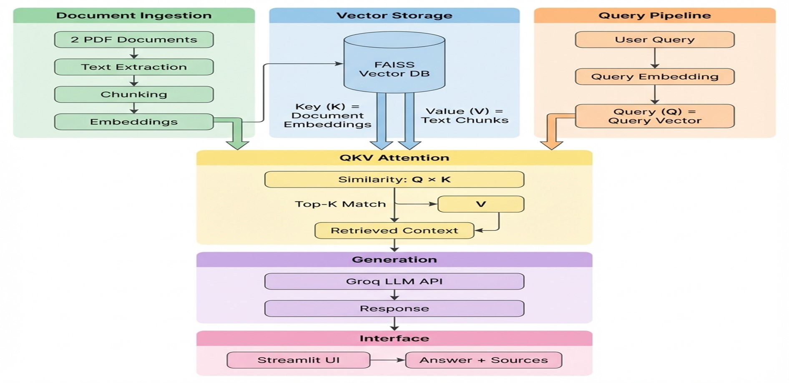

# 📚 Smart RAG Document Q&A System

A professional-grade Retrieval-Augmented Generation (RAG) system for intelligent document question-answering, built for university coursework.


---

## 🎯 Project Overview

This Smart RAG system enables users to ask questions about PDF documents and receive accurate, grounded answers with full source transparency. The system uses advanced retrieval techniques and anti-hallucination constraints to ensure all answers are strictly based on document content.

### Key Features

✅ **Document Processing**: Intelligent PDF text extraction with page-level metadata  
✅ **Semantic Chunking**: Context-aware text splitting for optimal retrieval  
✅ **Vector Search**: FAISS-based similarity search for relevant content  
✅ **Anti-Hallucination**: Temperature=0 and strict grounding constraints  
✅ **Source Transparency**: Full citation with document names and page numbers  
✅ **Prompt Visibility**: See exactly what's sent to the language model  
✅ **Professional UI**: Clean Streamlit interface for easy interaction

---

## 🏗️ System Architecture



The diagram above illustrates the complete RAG system architecture, showing the flow from document ingestion through vector storage, QKV attention mechanism, and generation to the final user interface.

## 📁 Project Structure

```
project/
│
├── app.py                    # Streamlit web application
├── config.py                 # Configuration management
├── document_processor.py     # PDF extraction and chunking
├── vector_store.py          # FAISS vector database
├── rag_pipeline.py          # RAG question-answering logic
│
├── requirements.txt         # Python dependencies
├── .env                     # Environment variable template
├── .gitignore               # Git ignore rules
│
├── data/                   # PDF documents directory
│   ├── document1.pdf       # First PDF (configure in config.py)
│   └── document2.pdf       # Second PDF (configure in config.py)
│
└── vector_db/              # Vector database storage (auto-created)
    ├── faiss_index.bin     # FAISS index file
    └── metadata.pkl        # Document metadata
```

---

## 🚀 Installation

### Prerequisites

- Python 3.8 or higher
- OpenAI API key ([Get one here](https://platform.openai.com/api-keys))
- Two PDF documents for question-answering

### Step 1: Clone or Download the Project

```bash
git clone https://github.com/Farhan3376/Smart-RAG-Document-Q-A-System.git
```

### Step 2: Install Dependencies

```bash
pip install -r requirements.txt
```

### Step 3: Configure API Key

1. Copy the environment template:
   ```bash
   copy .env.template .env
   ```

2. Edit `.env` and add your OpenAI API key:
   ```
   OPENAI_API_KEY=your_actual_api_key_here
   ```

### Step 4: Add PDF Documents

1. Place your two PDF documents in the `data/` directory
2. Edit `config.py` and update the PDF filenames:
   ```python
   PDF_DOCUMENTS = [
       DATA_DIR / "FAST3R.pdf",
       DATA_DIR / "MASt3R-slam.pdf",
   ]
   ```

---

## 💻 Usage

### Running the Application

```bash
streamlit run app.py
```

The application will open in your default web browser at `http://localhost:8501`

### First-Time Setup

1. **Process Documents**: On first run, click the "🔄 Process Documents" button in the sidebar
2. **Wait for Processing**: The system will extract text, create chunks, and generate embeddings
3. **Start Asking Questions**: Once processing is complete, you can start asking questions!

### Asking Questions

1. Enter your question in the text area
2. Click "🔍 Ask"
3. View the answer with source citations
4. Expand sections to see:
   - Evidence snippets from the documents
   - The exact prompt sent to the LLM
   - Query metadata and statistics

### Example Questions

- "What are the main topics covered in the documents?"
- "Can you summarize the key findings?"
- "What methodology is discussed?"
- "What is mentioned about [specific topic]?"

### Anti-Hallucination Behavior

If you ask a question that cannot be answered from the documents, the system will respond:

> "The answer is not available in the provided documents."

This ensures the system never uses external knowledge or makes up information.

---

## ⚙️ Configuration

All system settings can be customized in `config.py`:

### LLM Settings
- `LLM_MODEL`: Groq Cloud model to use 
- `TEMPERATURE`: Response randomness (default: `0.0` for anti-hallucination)
- `MAX_TOKENS`: Maximum response length (default: `1000`)

### Chunking Parameters
- `CHUNK_SIZE`: Characters per chunk (default: `1000`)
- `CHUNK_OVERLAP`: Overlap between chunks (default: `200`)

### Retrieval Settings
- `TOP_K_CHUNKS`: Number of chunks to retrieve (default: `4`)

---

## 🔬 Technical Details

### Document Processing Pipeline

1. **PDF Extraction**: Uses PyPDF2 to extract text page-by-page
2. **Text Cleaning**: Removes extra whitespace and normalizes formatting
3. **Semantic Chunking**: Uses LangChain's RecursiveCharacterTextSplitter with semantic separators
4. **Embedding Generation**: Creates 1536-dimensional vectors using OpenAI's `text-embedding-ada-002`

### RAG Pipeline

1. **Query Processing**: User question is embedded using the same model
2. **Similarity Search**: FAISS finds the top-K most similar chunks using L2 distance
3. **Context Assembly**: Retrieved chunks are formatted with source metadata
4. **Answer Generation**: GPT model generates answer with strict grounding instructions
5. **Source Extraction**: System tracks and displays all sources used

### Anti-Hallucination Mechanisms

- **Temperature = 0**: Ensures deterministic, grounded responses
- **System Prompt**: Explicit instructions to only use provided context
- **Fallback Response**: Returns specific message when answer not found
- **Source Verification**: All answers must cite document sources

---

## 🧪 Testing the System

### Test Document Processing

```bash
python document_processor.py
```

Expected output:
- Text extraction from PDFs
- Chunk creation statistics
- Sample chunk preview

### Test Vector Store

```bash
python vector_store.py
```

Expected output:
- Vector store initialization
- Document indexing
- Sample similarity search

### Test RAG Pipeline

```bash
python rag_pipeline.py
```

Expected output:
- End-to-end question answering
- Answer with source citations
- Prompt transparency

---


## 🎓 Academic Context

### Project Deliverables

✅ **Source Code**: Clean, modular, well-commented Python code  
✅ **Documentation**: Comprehensive README with architecture and usage  
✅ **Live Demo**: Functional Streamlit application  
✅ **Transparency**: Full visibility into retrieval and generation process  
✅ **Anti-Hallucination**: Strict document grounding with fallback responses


## 🛠️ Troubleshooting

### "Groq Cloud API key not configured"
- Ensure you've created a `.env` file from `.env.template`
- Verify your API key is correct and has credits

### "PDF documents not found"
- Check that PDFs are in the `data/` directory
- Verify filenames in `config.py` match actual files

### "No text extracted from PDF"
- Ensure PDFs contain extractable text (not scanned images)
- Try a different PDF or use OCR preprocessing

### "Vector store is empty"
- Click "🔄 Process Documents" in the sidebar
- Wait for processing to complete before asking questions

---

## 🙏 Acknowledgments

- **LangChain**: For RAG pipeline components
- **OpenAI**: For embeddings and language models
- **FAISS**: For efficient vector similarity search
- **Streamlit**: For rapid UI development

